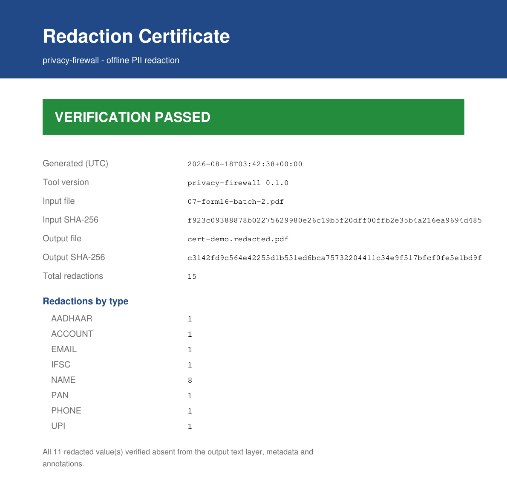

# Privacy Firewall

**Offline-first PII detection & redaction for documents.**

[](https://github.com/SurajSongara/privacy-firewall/actions/workflows/ci.yml)


[](LICENSE)

Detect and **physically remove** sensitive information from PDFs, images, and text documents — entirely on your machine. No cloud, no API keys, no telemetry. The web UI binds to `127.0.0.1` only; nothing ever leaves your computer.


*All values in the screenshots are synthetic — the account, PAN, Aadhaar, and person are fictitious.*

## Why this is different

Most "redaction" tools draw a black box over the text — the words are still in the file, one copy-paste away. Privacy Firewall **deletes the text objects from the PDF content stream** and regenerates the page, then **re-parses its own output to prove nothing leaked** and emits a signed-style audit certificate. If a value you redacted is still extractable — on the page, in the metadata, or in an annotation — the certificate **fails loudly** and the CLI exits non-zero.

## Highlights

- **9 detectors** — PAN, Aadhaar, Email, Phone, UPI, IFSC, Account Number, GSTIN, and person Names
- **Checksum-validated** — Aadhaar via the Verhoeff algorithm, GSTIN via its base-36 check digit, PAN/IFSC/UPI via structural rules — so detection is precise, not just a greedy regex
- **True redaction** — matched text is stripped from the PDF content stream via redaction annotations, not painted over; copy-paste and text extraction find nothing. Every occurrence is removed — including the same value written both plainly (`123456789012`) and in canonical spaced form (`1234 5678 9012`)
- **Verifiable redaction** — `--certificate` re-parses the output, proves none of the redacted values survive **anywhere** (text layer, metadata, or annotations), and emits an audit certificate (input/output hashes, counts by type, PASS/FAIL) that contains **no raw PII**
- **Hidden-surface scanning** — PII stamped into document **metadata** (Title/Author/Subject) or **annotations / form fields** is invisible on the page but readable in one click; the engine detects it, and redaction strips it wholesale
- **Batch mode** — `redact-batch` redacts a whole folder in one run and writes a CSV/JSON summary; originals are never touched
- **Review Studio** — a local web UI to review every detection, see *why* it matched, drag-select anything the detectors missed (even part of a word), and export
- **Workspace memory** — mark a term once with "remember", and it's flagged in every document in the workspace
- **OCR for scans** — RapidOCR / Tesseract / PaddleOCR backends with automatic native-vs-OCR-vs-hybrid pipeline selection
- **Multi-format** — PDFs natively; images (PNG, JPG, TIFF, BMP, WebP, GIF), TXT, MD, and DOCX are converted on upload
- **Deterministic engine** — regex + validators before any AI; fully offline, reproducible, and covered by **721 tests** with strict `mypy` and `ruff`

## The certificate — proof, not promises

Every `--certificate` run produces a one-page PDF (and matching JSON) you can hand to a client or auditor. It carries the input/output SHA-256 hashes, the redaction count by type, and a PASS/FAIL verdict — and **never** the redacted values themselves.



## Installation

### Desktop app (no Python needed)

Download the installer for your platform from the
[latest release](https://github.com/SurajSongara/privacy-firewall/releases):

| Platform | File | Notes |
|---|---|---|
| Windows | `PrivacyFirewall-Setup-<version>.exe` | Installs per-user; no admin rights required |
| macOS | `PrivacyFirewall-<version>.dmg` | Drag to Applications |
| Linux | `PrivacyFirewall-<version>-linux-x86_64.tar.gz` | Extract and run `./PrivacyFirewall` |

Everything is bundled — Python, the PDF engine, and OCR for scanned documents.
Launching the app opens the Studio dashboard in your browser on a
`PrivacyFirewall` folder inside your Documents. The same binary is also a full
CLI: `PrivacyFirewall detect statement.pdf`.

> The installers are currently **unsigned**, so Windows SmartScreen shows an
> "unrecognised app" warning and macOS Gatekeeper requires right-click → Open.
> (Removing the warning needs a paid code-signing certificate; the build is
> wired to sign automatically once one is provided.)

### From source

Requires **Python ≥ 3.12**.

```bash
git clone https://github.com/SurajSongara/privacy-firewall.git
cd privacy-firewall
pip install -e ".[ui,ocr-lite]"
```

| Extra | What it adds |
|---|---|
| `ui` | The review Studio web UI (FastAPI + uvicorn) |
| `ocr-lite` | **Recommended OCR backend** — RapidOCR via ONNX Runtime: pure wheels, models bundled, no system binary |
| `ocr` | PaddleOCR backend (needs `paddlepaddle`, which has no Python 3.14 wheel yet) |
| `docx` | DOCX upload support |
| `dev` | pytest, ruff, mypy, pre-commit |

Tesseract is also supported if you have `tesserocr` and a tessdata directory installed.

## Quick start — CLI

```bash
# List all PII detections with evidence and confidence
python -m privacy_firewall detect statement.pdf
```

```text
Pipeline: Native text extraction
Detections (8):
    1. Page 1 | AADHAAR  | '295101016126'                 | confidence=1.00 | detector=aadhaar
    2. Page 1 | EMAIL    | 'poojagupta569@hotmail.com'    | confidence=0.90 | detector=email
    3. Page 1 | NAME     | 'poojagupta'                   | confidence=0.60 | detector=name
    4. Page 1 | PAN      | 'LLLGY3630E'                   | confidence=0.95 | detector=pan
    5. Page 1 | PHONE    | '7176005879'                   | confidence=0.85 | detector=phone
    6. Page 2 | ACCOUNT  | '59006891774'                  | confidence=0.95 | detector=account
    7. Page 2 | IFSC     | 'SBIN0T92TKR'                  | confidence=0.95 | detector=ifsc
    8. Page 2 | UPI      | 'pooja.gupta61@okaxis'         | confidence=0.95 | detector=upi
```

Each detection carries its **evidence** (matched text, page, span, bounding box), a **confidence** score, and a **human-readable reason** (e.g. *"matches 12-digit Aadhaar format · Verhoeff checksum passed"*).

```bash
# Produce a redacted copy and PROVE it: writes <out>.certificate.{json,pdf},
# exits non-zero if anything leaked.
python -m privacy_firewall redact statement.pdf statement.redacted.pdf --certificate
```

```text
Pipeline: Native text extraction
Redacted PDF saved to: statement.redacted.pdf
Redactions applied: 15
Verification: PASSED - All 11 redacted value(s) verified absent from the output text layer, metadata and annotations.
Certificate: statement.redacted.certificate.json  /  statement.redacted.certificate.pdf
```

```bash
# Redact a whole folder in one run, with a CSV/JSON summary and per-file verification.
python -m privacy_firewall redact-batch ./client-docs --out ./redacted --certificate
```

```text
Redacting 3 document(s) into ./redacted

  OK  03-tricky-edge-cases.pdf - 20 redaction(s) [verified]
  OK  05-payslip-batch-2.pdf - 13 redaction(s) [verified]
  OK  07-form16-batch-2.pdf - 15 redaction(s) [verified]

Done: 3 redacted, 0 error(s), 48 total redaction(s).
Summary: ./redacted/redaction-summary.csv
```

```bash
# Health report: text quality, layout, and an OCR recommendation.
python -m privacy_firewall doctor statement.pdf
```

```text
=== Document Diagnostics ===
Pages:          2
Native text:    yes
Encrypted:      no
Estimated scan: no
Pipeline:       native

--- Text Quality ---
  Overall:        0.9255
  Printable:      0.9724
  Issues: fragmented text (many short words)

--- OCR Recommendation ---
  Text quality is good. Native extraction should suffice.
```

More commands:

```bash
# Show document structure (blocks, spans, geometry)
python -m privacy_firewall scan statement.pdf

# Redaction styles: replace (***), black-bar, or highlight
python -m privacy_firewall redact statement.pdf out.pdf --type black-bar

# Scanned document? Force OCR, or let diagnostics decide
python -m privacy_firewall detect scan.pdf --ocr
python -m privacy_firewall detect scan.pdf --auto
```

### Common flags

| Flag | Commands | Effect |
|---|---|---|
| `--certificate` | redact, redact-batch | Verify the output and write an audit certificate |
| `--values-only` / `--full-block` | redact, redact-batch | Redact just the PII value vs. the whole text block |
| `--type <style>` | redact, redact-batch | `replace`, `black-bar`, or `highlight` |
| `--ocr` / `--auto` | scan, detect, redact, redact-batch | Force OCR, or let diagnostics pick native/OCR/hybrid |
| `--ocr-engine <name>` | scan, detect, redact, redact-batch | Pick a specific engine: `rapidocr`, `tesseract`, `paddleocr` |
| `--out <dir>` | redact-batch | Write redacted copies into a separate folder |
| `--password <pw>` | scan, detect, redact, redact-batch, doctor | Open a password-protected (encrypted) PDF |
| `--detector <name>` | detect | Run a single detector |

Password-protected PDFs are supported everywhere: pass `--password` (or omit it and you'll be prompted securely). The password is held in memory only, and the redacted output is written **unencrypted** so it can be shared.

## Quick start — Studio (web UI)

```bash
# Launch the Studio dashboard on a folder of documents
python -m privacy_firewall --workspace ~/Documents/statements

# Or review a single file
python -m privacy_firewall review statement.pdf
```

Your browser opens a local dashboard listing every document in the workspace. Drop new files onto it (PDF, images, TXT, MD, DOCX) — they're saved into the workspace folder and stay on your computer.


Open a document to review what was found — every detection shows its evidence and reason, colour-coded by whether it will be redacted, needs review, or is kept:


In the review screen you can:

- **Triage** — toggle redact/keep per item or per type, with keyboard shortcuts (`n`/`p` to jump between items needing review, `r` redact, `k` keep)
- **Mark anything** — drag a box over any text on the page (even part of a word) or type a term in the sidebar to mark every instance in the document
- **Remember terms** — tick *"Remember for every document in this workspace"* and the term is flagged in every other document, now and later
- **Preview** — see exactly what the exported PDF will look like before committing
- **Apply & export** — writes a `.redacted.pdf` next to the original; the review plan is saved as JSON alongside it

## What it guarantees — and what needs review

Being honest about the boundaries is the whole point of a privacy tool.

- **Structured IDs are the strong suit.** PAN, Aadhaar, Email, Phone, UPI, IFSC, Account, and GSTIN are matched by regex + checksum/structural validation, physically removed, and verified. On the bundled benchmark corpus these detectors score **100 % precision and recall**, and repeated/reformatted occurrences of the same value are all removed.
- **Names are best-effort.** The engine is deterministic-first with **no NER model**, so it catches names it can *corroborate* — an email handle, a UPI slug, a profile field — but a free-text name with no such anchor may be missed. Use Studio's drag-select (or a "remember" term) to mark those. **The certificate is your safety net:** if a value you marked is still extractable in the output, verification **fails** rather than quietly passing.
- **Phone vs. transaction references.** A bare 10-digit UTR/bank-reference can look like a phone number; context scoring suppresses most, but precision on adversarial inputs is ~75 %. Slash-delimited transaction tokens (`UPI/DR/…`) are excluded by design.
- **Nothing is ever modified in place.** The renderer always writes a new file; your original is untouched.

## How it works

```
PDFParser ──► OCRProvider (optional) ──► HybridMerger ──► Detectors (9)
                                                              │
   new PDF ◄── PDFRenderer ◄── RedactionPlanner ◄── DecisionEngine ◄── FusionEngine
     │
     └──► Verifier (re-parse output, assert no leak) ──► Certificate
```

- Each stage exchanges immutable Pydantic v2 models — the engine has zero framework dependencies, and the CLI/UI are thin wrappers around it.
- Detectors are pure functions `(Document) → list[Detection]`, individually testable, with priority tiers (`regex > validator > heuristic > ner > llm`) used by the fusion engine to resolve overlaps.
- A context scorer adjusts confidence using the surrounding line (e.g. a 10-digit number on a line mentioning *UTR* is not a phone number), and a policy maps confidence to *redact / ask / keep* suggestions.
- Redaction deletes the text objects covering each match and regenerates the page content stream, re-inserting the surviving characters at their original positions — the text leaves the file rather than being covered up. Scanned pages have the underlying image pixels zeroed. The verifier then re-parses the output and re-runs every detector, plus a metadata/annotation re-scan, before the certificate can say PASS.

## Project structure

```
src/privacy_firewall/
├── __main__.py        # Typer CLI (studio is the default command)
├── cli/               # One file per subcommand — zero business logic
├── models/            # Frozen Pydantic v2 models (Document, Detection, …)
├── parsers/           # PDFium PDF parser (pypdfium2)
├── ocr/               # OCR provider registry + Tesseract/Paddle/RapidOCR adapters
├── detectors/         # 9 detectors + registry + dedup utilities
├── engine/            # Context scoring, fusion, decision, redaction, verification
├── diagnostics/       # Text-quality analysis + pipeline recommendation
├── layout/            # Header/footer/paragraph classification
├── bank_profiler/     # Per-bank statement profiles (SBI, HDFC, ICICI, Axis)
├── renderer/          # Destructive PDF renderer
└── ui/                # Review Studio (FastAPI, localhost only)

benchmarks/            # Precision benchmark vs. golden synthetic corpus
examples/synthetic/    # Golden dataset (all values fabricated)
packaging/             # PyInstaller + Inno Setup desktop-installer build
tests/                 # 721 tests (pytest)
```

## Development

```bash
pip install -e ".[dev,ui]"
pytest                      # full suite (721 tests)
ruff check src/ tests/      # lint
mypy src/                   # strict type-checking
python -m benchmarks.precision   # precision/recall vs. the golden corpus
```

## Privacy

This tool exists to keep your documents private, and it practices what it preaches: no network calls, no telemetry, no cloud OCR. The web UI binds to `127.0.0.1` only. Everything — parsing, OCR, detection, redaction — runs locally.

## License

[GNU AGPL-3.0](LICENSE) — currently, by choice rather than obligation.

The PDF engine is [pypdfium2](https://github.com/pypdfium2-team/pypdfium2) (BSD-3-Clause/Apache-2.0) wrapping Google's PDFium (BSD-3-Clause); the rest of the runtime is Pillow (MIT-CMU), pydantic, Typer and PyYAML (all MIT/BSD). **No copyleft component is linked or distributed**, so this project is free to be relicensed under permissive terms. PyMuPDF remains a test-only dependency — it builds fixtures and acts as an independent verifier of redaction output — and is explicitly excluded from packaged builds. Build and packaging details are in [`packaging/README.md`](packaging/README.md).
